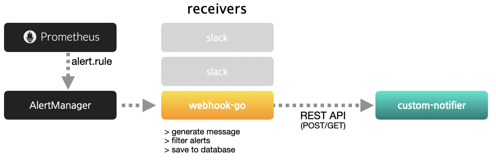

# webhook-go

1. Webhook for alertmanger
2. Message template management
3. Alarm target management



## Build & Run
```bash
go get github.com/go-gywn/webhook-go
cd $GOPATH/src/github.com/go-gywn/webhook-go
go build .
./webhook-go

## debugging
LOGGING=debug ./webhook-go 
```

## Config for prometheus & alertmanager

### Prometheus alert rule example
```yaml
groups:
- name: example
  rules:
  - alert: mysql_connection
    expr: mysql_global_status_threads_connected >= 50
    labels: 
      level: warning
    annotations:
      summary: "Connection on {{ $labels.instance }}"
      description: "{{ $labels.instance }} : (current value: {{ $value }})"
  - alert: mysql_connection
    expr: mysql_global_status_threads_connected >= 100
    labels: 
      level: critical
    annotations:
      summary: "Connection on {{ $labels.instance }}"
      description: "{{ $labels.instance }} : (current value: {{ $value }})"
```

### Alertmanager config example
```yaml
global:
  resolve_timeout: 5m 
route:
  group_by: ["alertname", "level", "instance"] 
  group_wait: 10s
  group_interval: 10s
  repeat_interval: 24h
  receiver: "web.hook" 
receivers:
- name: "web.hook"
  webhook_configs:
  - url: "http://127.0.0.1:52802/webhook/hook/send"
```

## Configuration webhook example
```yaml
base: "webhook"
port: ":52802"
loglevel: "RELEASE" ## DEBUG / TEST / RELEASE
timezone: "Asia/Seoul"
database:
  host: "127.0.0.1:3306"
  user: "webhook"
  pass: "l-6ILJ3Y6yahD7ibKwNe-t12rt1ahMUU6mI="
  schema: "webhook"
webhook:
  template: "tempalte.tpl"
  labelmapper:
    instance: "instance"
    level: "level"
    job: "job"
  annotationmapper:
    description: "description"
    summary: "summary"
  targets:
    critical:
      api: "http://127.0.0.1:52802/webhook/hook/test"
      params: "id=12345&message=[[message]]"
      method: "POST"
    warning:
      api: "http://127.0.0.1:52802/webhook/hook/test"
      params: "id=54321&message=[[message]]"
      method: "POST"
```

## Generate encrypted password
Webhook config must be defiend
```
./webhook-go --password="mydb_password"
<Encrypted>
MlLE806MCqowWKd6Fzf2JbeD0vx7_MtZiGDA5SE=
```

## Template example
We can change message format with template 
If the template file loading fails, a message is sent with the default template below.
```
[{{ .status }}] {{ .summary }}
> Instance: {{ .instance }}
> Level: {{ .level }}{{ if eq .status "firing" }}
> Start: {{ .startsAt.Format "01/02 15:04:05 MST" }}{{ else }}
> Start: {{ .endsAt.Format "01/02 15:04:05 MST" }}
> End: {{ .endsAt.Format "01/02 15:04:05 MST" }}{{ end }}
> Description: {{ .description }}
```

### Deafult tempalte variables

Variable name | Template variable     | Description
--------------|-----------------------|--------------
alertname     | {{ .alertname }}      | Alert name
instance      | {{ .instance }}       | Instance name from prometheus
status        | {{ .status }}         | firing or resloved
level         | {{ .level }}          | critical or warning, you can set on alert rule 
job           | {{ .job }}            | job from prometheus
startsAt      | {{ .startsAt }}       | start time
endsAt        | {{ .endsAt }}         | resolved time
summary       | {{ .summary }}        | summary, you can set on alert rule annotaion
description   | {{ .description }}    | description, you can set on alert rule annotaion

You can add or change the label name by changing labelmapper or annotationmapper in the configuration file.

## REST API
REST API to controll webhook

Method | API                            | Description
-------|--------------------------------|-------------
POST   | /webhook/hook/template/reload  | template reload
POST   | /webhook/hook/ignore           | add new to ignore alert
DELETE | /webhook/hook/ignore           | delete ingnored alert
POST   | /webhook/hook/send             | webhook endpoint, this is for AlertManager webhook config
POST   | /webhook/hook/shoot            | One time alert POST API
GET    | /webhook/hook/shoot            | One time alert GET API
POST   | /webhook/hook/test             | TEST listen POST API
GET    | /webhook/hook/test             | TEST listen GET API

### Example
1. Template reload
    ```bash
    curl -XPOST 127.0.0.1:52802/webhook/hook/template/reload
    ```
2. Add ignore target
    ```bash
    ## Ignore all alert for 1 hour(default)
    curl -XPOST 127.0.0.1:52802/webhook/hook/ignore

    ## Ignore ena031 instance for 1 hour(default)
    curl -XPOST \
    --data-urlencode 'instance=ena031' \
    127.0.0.1:52802/webhook/hook/ignore

    ## Ignore "node_cpu_usage" alert from ena031 instance
    curl -XPOST \
    --data-urlencode 'instance=ena031' \
    --data-urlencode 'alert_name=node_cpu_usage' \
    127.0.0.1:52802/webhook/hook/ignore

    ## Ignore "node_cpu_usage" resolved alert from ena031 instance, permanently
    curl -XPOST \
    --data-urlencode 'instance=ena031' \
    --data-urlencode 'alert_name=node_cpu_usage' \
    --data-urlencode 'job=linux' \
    --data-urlencode 'status=resolved' \
    --data-urlencode 'forever=true' \
    127.0.0.1:52802/webhook/hook/ignore

    ## Ignore alert from ena031 instance for a specific time
    curl -XPOST \
    --data-urlencode 'instance=ena031' \
    --data-urlencode 'starts_at=2020-09-14T00:00:00+09:00' \
    --data-urlencode 'ends_at=2020-09-21T00:00:00+09:00' \
    127.0.0.1:52802/webhook/hook/ignore

    ## Send single alert
    curl -XPOST \
    --data-urlencode 'instance=test01' \
    --data-urlencode 'level=critical' \
    --data-urlencode 'summary=test alert summary' \
    --data-urlencode 'message=this is test alert message' \
    127.0.0.1:52802/webhook/hook/shoot
    ```
Enjoy!

(Special thanks for good testing, [@ena-yoon]( https://github.com/ena-yoon ))
